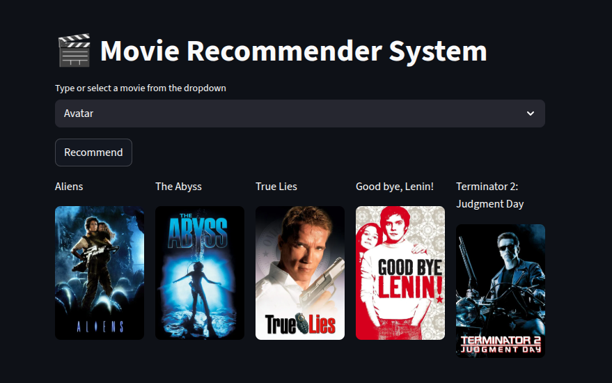

# 🎬 Movie Recommender System

A **Movie Recommendation System** built with **Python**, **Streamlit**, and **TMDB API**, which suggests movies based on your selection and displays their posters.  

---

## 🔹 Features
- Type or select a movie from a dropdown.
- Get **5 recommended movies** based on similarity.
- Displays **movie posters** fetched dynamically from **TMDB API**.
- User-friendly **Streamlit interface**.

---

## 🔹 Tech Stack
- **Python 3**
- **Streamlit** – for the web app UI
- **Pandas & Pickle** – for storing and loading movie data
- **Requests** – to fetch movie posters from TMDB API
- **Cosine Similarity** – for movie recommendation logic

---

## 🔹 Installation

1. Clone this repository:
```bash
git clone <your-repo-url>
cd movie-recommender
```

2. Install dependencies:
```bash
pip install -r requirements.txt
```

3. Make sure you have **`content.pkl`** and **`cosine.pkl`** in the project folder.

4. Run the app:
```bash
streamlit run app.py
```

---

## 🔹 Usage

1. Open the Streamlit app in your browser.
2. Select or type a movie from the dropdown menu.
3. Click **Recommend**.
4. See 5 recommended movies with their **posters**.

---

## 🔹 Project Structure

```
movie-recommender/
│
├── app.py              # Main Streamlit app
├── content.pkl         # Pickle file containing movie data
├── cosine.pkl          # Pickle file containing cosine similarity matrix
├── requirements.txt    # Python dependencies
└── README.md           # Project documentation
```

---

## 🔹 TMDB API
- Movie posters are fetched using **TMDB API**.
- Replace `YOUR_API_KEY` in `app.py` with your TMDB API key.
- TMDB Documentation: [https://developer.themoviedb.org](https://developer.themoviedb.org)

---

## 🔹 Screenshot




## 🔹 License
This project is licensed under the MIT License.